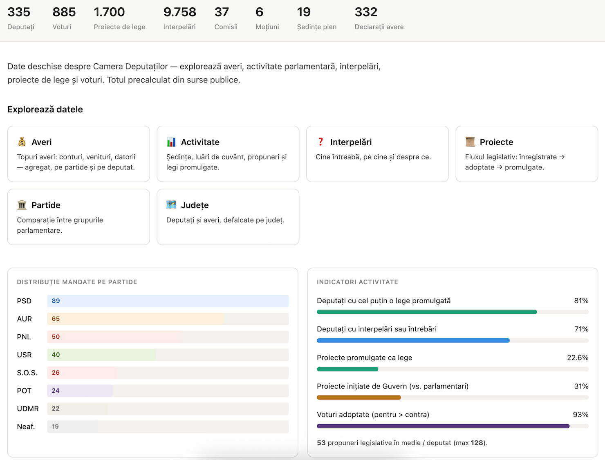
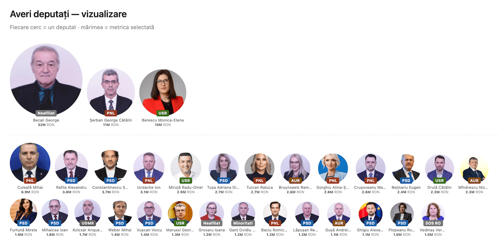
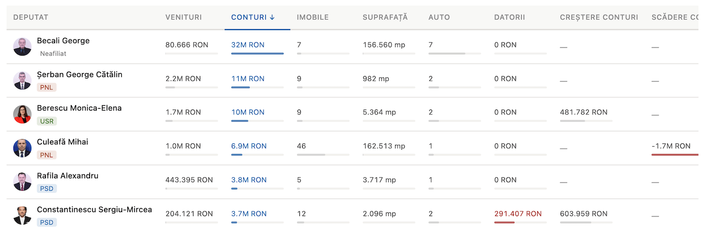
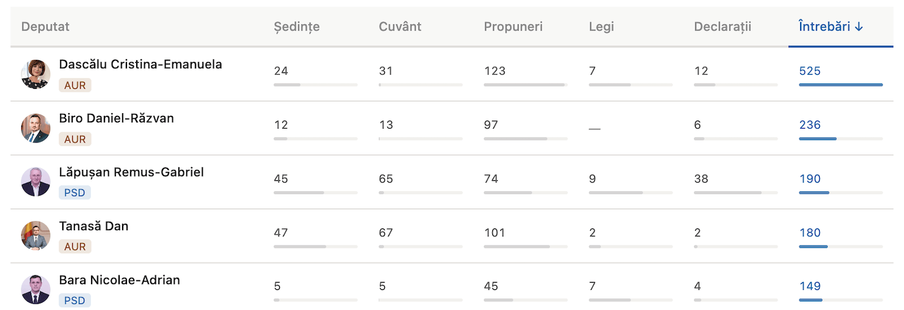
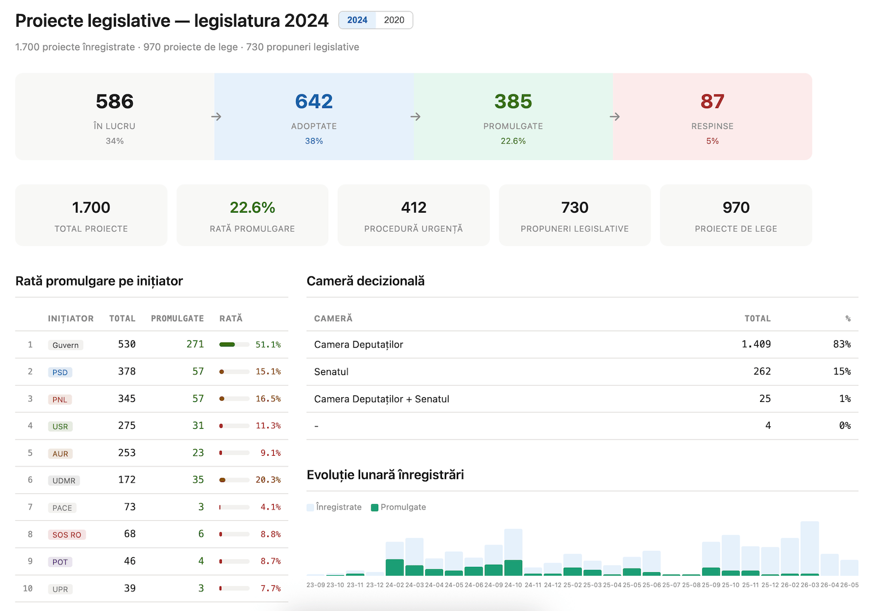
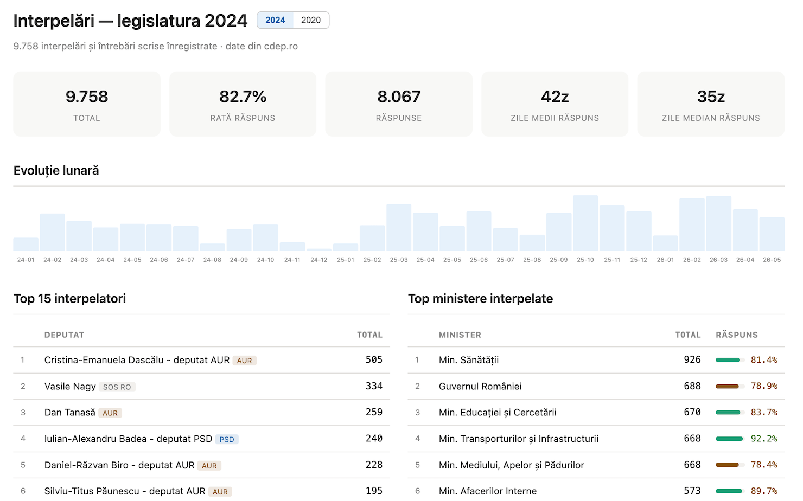

# CDEP Stats — statistici parlamentare Camera Deputaților

[lab.gov2.ro/cdep](https://lab.gov2.ro/cdep/)

Dashboard de statistici și transparență parlamentară pentru Camera Deputaților.

<mark>⚠️Notă</mark>: proiect în lucru (WIP) – datele nu sunt 100% verificate. Dacă observi vreo incorectitudine adăugă [un issue](https://github.com/gov2-ro/cdep-stats/issues) sau scrie-ne la poșta redacției: cancelarie@gov2.ro 

## Secțiuni

- **Deputați** — profile complete cu activitate, voturi, interpelări, declarații de avere; linkuri către profiluri [monitorul.ai](https://monitorul.ai/)
- **Voturi** — defalcare nominală per deputat, agregare pe partide
- **Interpelări** — 9.700+ întrebări și interpelări parlamentare (2024–2026)
- **Proiecte legislative** — stadiu, timeline, amendamente, promulgare
- **Ordinea de zi** — ședințele plenului Camera Deputaților cu clasificare automată pe tip (proiecte de lege, hotărâri, moțiuni) și extragere de entități (categorie lege, comisii, acte normative referențiate, indicatori procedurali)
- **Comisii** — componență și conducere
- **Declarații de avere** — sumar și delta față de declarația anterioară

## Date 

- Sursa datelor: [www.cdep.ro](https://www.cdep.ro) — date publice ale Camerei Deputaților, descărcate utilizând [Endimion2k/cdep-api-poc](https://github.com/Endimion2k/cdep-api-poc)
- Licență: [Open Government License v3.0](https://www.nationalarchives.gov.uk/doc/open-government-licence/version/3/)

----

